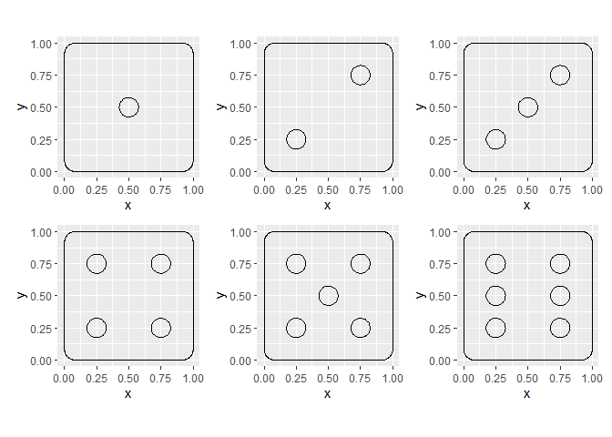
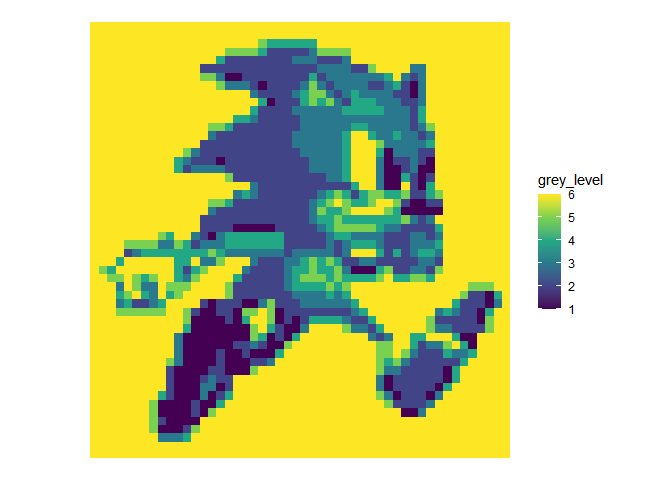

<!-- README.md is generated from README.Rmd. Please edit that file -->

# image-dice

An idea inspired by this
[video](https://www.reddit.com/r/StarWars/comments/u6ar6p/have_a_good_week/?utm_medium=android_app&utm_source=share)

``` r
library(tidyverse)
library(sf)
library(magick)
```

-   Use `{sf}` to create a rounded corner square for the dice body
    -   Create a square polygon and then buffer it to have rounded
        corners
    -   Normalize the buffered square to be between 0 and 1
-   We can optionally buffer again now with a small negative number so
    that the dice body does not fill the whole frame from 0 to 1
-   Convert to a dataframe with a grouping `g` column set to zero for
    use with `geom_polygon()` later on

``` r
dice_body <-
  st_polygon(x = list(matrix(c(0,0,1,1,0,0,1,1,0,0), ncol=2))) %>% 
  st_buffer(0.1) %>% 
  st_normalize() %>%
  # st_buffer(-0.005) %>% # reduce dice body size so they don't quite touch eachother when placed on the grid  
  st_coordinates() %>% 
  as_tibble() %>% 
  transmute(g = 0, x = X, y = Y)
```

-   Create a function that returns the coordinates for a dice dot
-   Using the same grouping `g` column as the dice body

``` r
dot <- function(x=0, y=0, rad=1, res = 60, group = 1){
  a <- seq(0, 2*pi, l=res)
  
  tibble(g = group,
         x = x + (cos(a)*rad),
         y = y + (sin(a)*rad))}
```

-   Use the `dot()` function to create each individual dice face
    -   First create a dataframe with a dot in all of the 7 positions
        possible
    -   Then filter it to only the dots needed for each side of the dice

``` r
all_spots <- bind_rows(dice_body,
                       dot(0.25, 0.25, rad = 0.075, group = 1),
                       dot(0.25, 0.50, rad = 0.075, group = 2),
                       dot(0.25, 0.75, rad = 0.075, group = 3),
                       dot(0.50, 0.50, rad = 0.075, group = 4),
                       dot(0.75, 0.25, rad = 0.075, group = 5),
                       dot(0.75, 0.50, rad = 0.075, group = 6),
                       dot(0.75, 0.75, rad = 0.075, group = 7))

six <- all_spots %>% filter(g != 4)
five <- all_spots %>% filter(g %in% c(0,1,3,4,5,7))
four <- all_spots %>% filter(g %in% c(0,1,3,5,7))
three <- all_spots %>% filter(g %in% c(0,1,4,7))
two <- all_spots %>% filter(g %in% c(0,1,7))
one <- all_spots %>% filter(g %in% c(0,4))
```

-   Bring the dice sides together into a list and visualise as a check

``` r
all_dice <- list(one, two, three, four, five, six)

map(all_dice, 
    ~ggplot(.x)+
      geom_polygon(aes(x,y,group=g), fill = NA, col = 1) + 
      coord_equal()) %>% 
  patchwork::wrap_plots()
```

<!-- -->

-   Read image and reduce to 50 pixels wide and 6 shades of grey

``` r
i <- 
  image_read("https://www.nicepng.com/png/detail/149-1491820_8-bit-sonic-pixel-art.png") %>% 
  image_resize("50x") %>%
  image_convert(colorspace = "gray") %>%
  # image_quantize(6, dither = FALSE) %>% # this wont always give us exactly 6 shades 
  image_raster() %>% 
  mutate(col2rgb(col) %>% t() %>% as_tibble()) %>% 
  select(ix=x, iy=y,v=red) %>% 
  as_tibble() %>% 
  mutate(grey_level = cut(v, breaks = 6, labels = FALSE))
```

-   Visualise the reduced image

``` r
i %>% 
  ggplot() + 
  geom_raster(aes(ix, iy, fill = grey_level)) + 
  scale_y_reverse() + 
  scale_fill_viridis_c() + 
  coord_equal() +
  theme_void()
```

<!-- -->

-   Place the relevant dice side at each pixel point by shifting the
    dice coordinates by the x and y pixel positions
-   **This is slow**

``` r
i_dice <- 
  i %>% 
  mutate(d = pmap(list(ix, iy, grey_level), 
                  ~all_dice[[..3]] %>% mutate(x = x + ..1,y = y + ..2))) %>% 
  unnest(d)
```

-   Set a colour for the dice body and dots
    -   If a light body and dark dots are required, the order of the
        `all_dice` list needs to be reversed
-   Visualise the final image by plotting all of the polygons
-   Note that using `scale_y_reverse()` inverts the dice side spots
    (which practically only impacts the two and three)

``` r
i_dice %>%
  mutate(dice_fill = case_when(g == 0 ~ "grey10", TRUE ~ "white")) %>% 
  ggplot()+
  geom_polygon(aes(x,y,group=interaction(ix,iy,g), fill = I(dice_fill)), col=NA)+
  coord_equal()+
  scale_y_reverse()+
  theme_void()
```

<!-- -->

``` r
ggsave("out.pdf", width=10, height=10)
```
